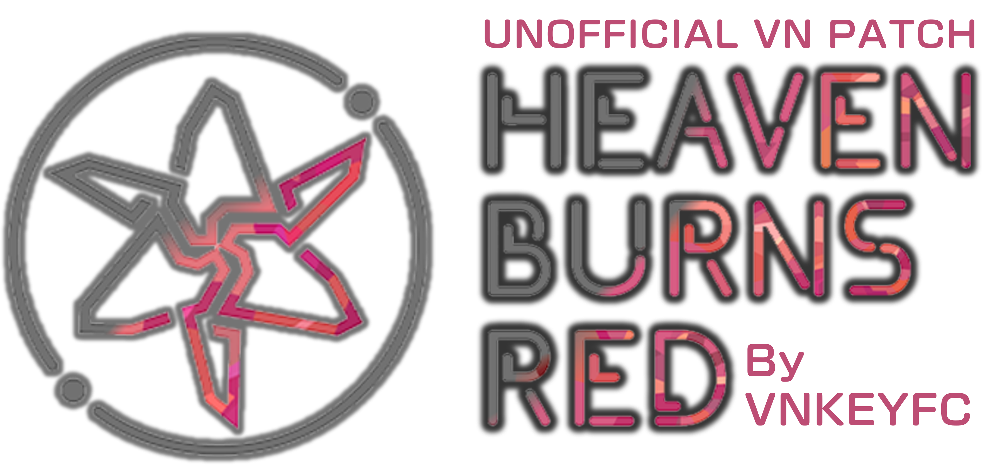
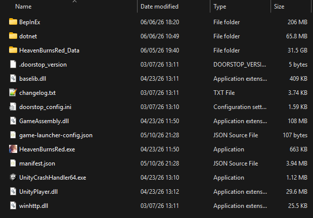

<h2 align="center">

  
<i>Bản vá Việt Hoá cho phiên bản quốc tế của Heaven Burns Red</i>
 
 
</h2>

⚠️ **CẢNH BÁO:** _Việc sử dụng bản vá này sẽ vi phạm vào điều khoản dịch vụ của game và có thể khiến tài khoản của bạn bị khoá. Chúng tôi sẽ không hoàn toàn chịu trách nhiệm cho những hành vi của bạn khi sử dụng công cụ này._

Đây là bản vá tiếng Việt cho [phiên bản quốc tế của Heaven Burns Red](https://heavenburnsred.yo-star.com/), do WRIGHT FLYER STUDIOS và VISUAL ARTS/Key cùng phát triển, được phát hành toàn quốc bởi Yostar Games. Dự án này tập trung vào việc thực hiện dịch thuật cho phần giao diện và cốt truyện của game sang tiếng Việt, để người chơi tại Việt Nam có thể dễ dàng tiếp cận với tựa game.

_Chúng tôi sẵn lòng đón nhận mọi hỏi đáp và góp ý từ mọi người nhằm phát triển cũng như sửa đổi dự án để phù hợp!_

## Nội dung
- [ CÀI ĐẶT](#-cài-đặt)

## Cài đặt

1. Hãy chắc chắn rằng bạn đã cài đặt nền tảng PC của [Heaven Burns Red](https://heavenburnsred.yo-star.com/) thông qua Launcher của Yostar, không phải trên nên tảng di động. 
2. Tải [phiên bản mới nhất](https://github.com/vnkeyfc/HBR-EN_Vi-Patch/releases) của bản vá.
3. Giải nén tất cả nội dung trong file zip đến đường dẫn `...\YostarGames\HeavenBurnsRed`
4. Thư mục `HeavenBurnsRed` sẽ trông như thế này

_Lần khởi chạy đầu tiên có thể tốn vài phút để vào game, những lần khởi chạy sau sẽ trở lại bình thường._

## Cập nhật

## Gỡ cài đặt

## Cấu hình và tuỳ chỉnh
