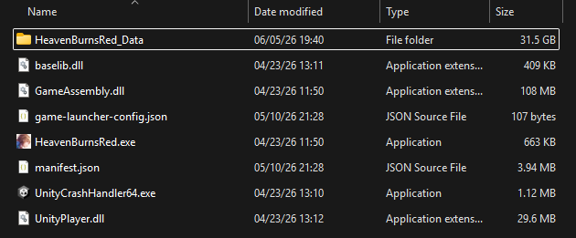

<div align="center">


<br>

<a href="https://discord.com/invite/vnkeyfc"></a>
<a href="https://github.com/BepInEx/BepInEx"></a>
<a href="https://github.com/bbepis/XUnity.AutoTranslator"></a>

### Bản vá tiếng Việt dành cho Heaven Burns Red bản quốc tế

Giúp người chơi theo dõi giao diện và nội dung cốt truyện bằng tiếng Việt ngay trong game.

[Tải bản phát hành mới nhất](https://github.com/vnkeyfc/HBR-EN_Vi-Patch/releases) · [Tham gia Discord](https://discord.com/invite/zhEn2g3ww5)

</div>

#

> ⚠️<b>CẢNH BÁO:</b> Đây là dự án cộng đồng, không thuộc WRIGHT FLYER STUDIOS, VISUAL ARTS/Key hay Yostar Games. Việc sử dụng bản vá có thể không phù hợp với điều khoản dịch vụ của trò chơi. Bạn tự chịu trách nhiệm đối với tài khoản và dữ liệu của mình khi cài đặt.

#

##  Nội dung

- [Tổng quan](#-tổng-quan)
- [Bản vá gồm những gì?](#-bản-vá-gồm-những-gì)
- [Cài đặt](#-cài-đặt)
- [Cập nhật](#cập-nhật)
- [Gỡ cài đặt](#gỡ-cài-đặt)
- [Cấu hình và tùy chỉnh](#-cấu-hình-và-tùy-chỉnh)
- [Hỗ trợ và đóng góp](#-hỗ-trợ-và-đóng-góp)

##  Tổng quan

Đây là bản vá không chính thức dành cho phiên bản PC quốc tế của [Heaven Burns Red](https://heavenburnsred.yo-star.com/). Dự án hướng tới việc Việt hóa giao diện, hội thoại và các nội dung liên quan để trải nghiệm trò chơi thuận tiện hơn với người dùng tiếng Việt.

Bản vá hoạt động thông qua BepInEx và XUnity.AutoTranslator, đồng thời bổ sung một số plugin riêng để xử lý những thành phần đặc thù của trò chơi.

##  Bản vá gồm những gì?

- Nội dung giao diện và cốt truyện đã được chuyển sang tiếng Việt.
- Font, texture và các thiết lập cần thiết được đóng gói sẵn.
- Một số plugin tùy chỉnh giúp cải thiện khả năng hiển thị và chất lượng bản dịch.
- Các cấu hình cốt lõi đã được thiết lập sẵn cho Heaven Burns Red. Người chơi không nên tự ý thay đổi vì có thể khiến bản vá hoạt động không ổn định hoặc làm nội dung dịch hiển thị sai.

##  Cài đặt

### Yêu cầu

- Heaven Burns Red bản PC được cài từ Yostar Games Launcher.
- Không áp dụng cho phiên bản Android, iOS hoặc giả lập di động.
- Nên thoát hoàn toàn trò chơi trước khi cài đặt hay cập nhật bản vá.

### Cài đặt thủ công

1. Tải gói mới nhất tại trang [Releases](https://github.com/vnkeyfc/HBR-EN_Vi-Patch/releases).
2. Mở tệp ZIP vừa tải về.
3. Giải nén toàn bộ nội dung vào thư mục cài game, thường có dạng:

   ```text
   ...\YostarGames\HeavenBurnsRed
   ```

4. Cho phép gộp thư mục hoặc ghi đè tệp nếu Windows yêu cầu.
5. Kiểm tra cấu trúc sau khi giải nén theo hình minh họa:

   

Lần khởi động đầu tiên có thể lâu hơn bình thường do BepInEx và các plugin cần tạo dữ liệu ban đầu. Những lần mở game tiếp theo sẽ nhanh hơn.

### Trình cài đặt tự động

Trình cài đặt tự động hiện vẫn trong giai đoạn thử nghiệm. Bạn có thể tải [ở đây](https://mega.nz/file/RIBl1QAA#R1tZKDH1m4C3NTlCjizb7gAUeP_JvYzkA3dGWujWj8g) để trải nghiệm trước.

##  Quản lý bản vá

### Cập nhật

Để tránh tệp cũ xung đột với bản mới:

1. Thoát game.
2. Xóa thư mục `BepInEx` của bản vá đang dùng.
3. Tải bản phát hành mới nhất rồi giải nén lại vào thư mục `HeavenBurnsRed`.

Nếu bạn đã tự chỉnh bản dịch hoặc cấu hình, hãy sao lưu các tệp đó trước khi xóa bản cũ.

### Gỡ cài đặt

Bản vá không thay thế dữ liệu gốc của trò chơi. Để đưa game về trạng thái chưa cài bản vá, hãy xóa các mục sau trong thư mục `HeavenBurnsRed`:

```text
BepInEx\
dotnet\
changelog.txt
doorstop_config.ini
winhttp.dll
.doorstop_version
```

Sau đó xóa thêm thư mục sau nếu nó tồn tại:

```text
%APPDATA%\BepInEx
```

Thư mục game sau khi gỡ sẽ có cấu trúc tương tự hình dưới đây:



##  Cấu hình và tùy chỉnh

Dự án sử dụng bản Bleeding Edge của [BepInEx](https://builds.bepinex.dev/projects/bepinex_be) cùng một bản fork của [bbepis/XUnity.AutoTranslator](https://github.com/bbepis/XUnity.AutoTranslator). Mã nguồn của bản fork đã được điều chỉnh và tối ưu riêng cho Heaven Burns Red nhằm cải thiện khả năng nhận diện, xử lý và hiển thị nội dung dịch trong game.

Bạn có thể tham khảo các tùy chọn cấu hình tại:
- [Hướng dẫn cấu hình BepInEx](https://docs.bepinex.dev/articles/user_guide/configuration.html)
- [Các tùy chọn của XUnity.AutoTranslator](https://github.com/bbepis/XUnity.AutoTranslator#configuration)

Chỉ nên thay đổi những thông số bạn hiểu rõ. Một cấu hình không tương thích có thể khiến bản dịch không xuất hiện hoặc làm plugin hoạt động sai.

##  Hỗ trợ và đóng góp

Nếu gặp lỗi, hãy gửi mô tả vấn đề, ảnh chụp màn hình và tệp log liên quan trên [máy chủ Discord của dự án](https://discord.com/invite/zhEn2g3ww5). Các góp ý về câu chữ, thuật ngữ và chất lượng bản dịch đều được hoan nghênh.

Khi báo lỗi, vui lòng cho biết phiên bản game và phiên bản bản vá đang sử dụng để việc kiểm tra thuận tiện hơn.
